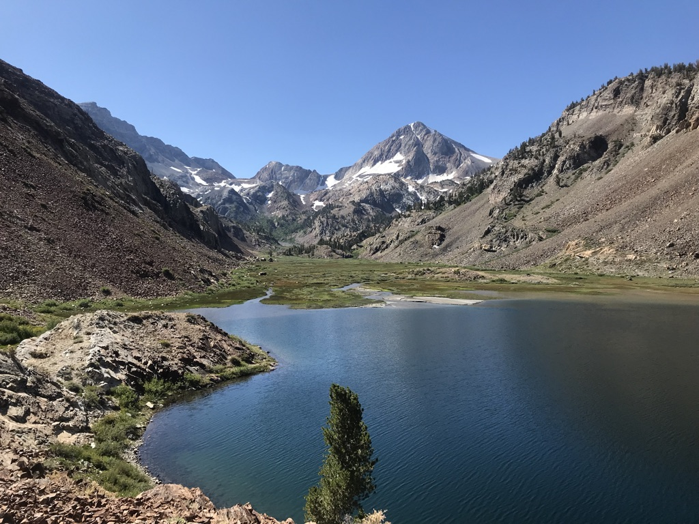
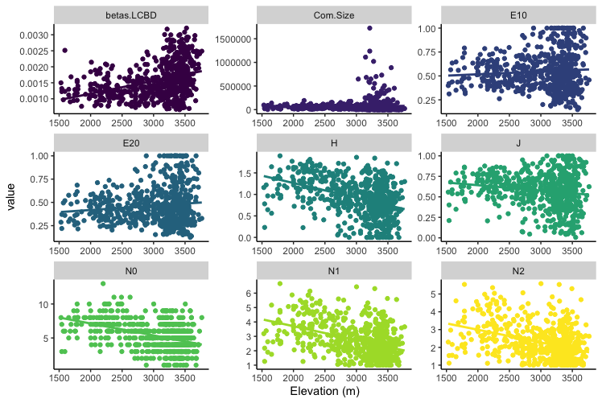
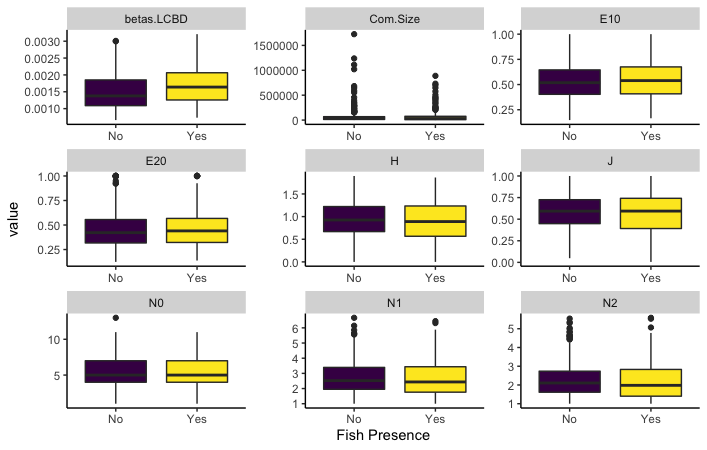
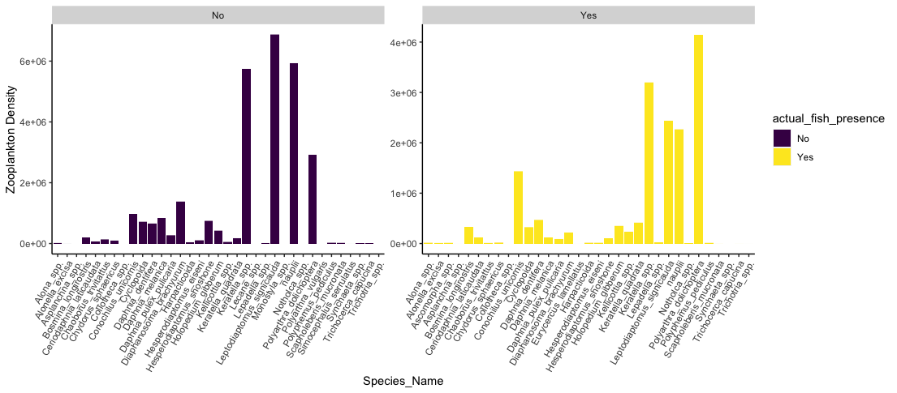
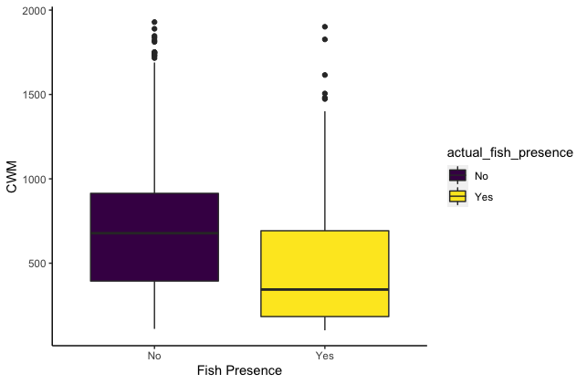
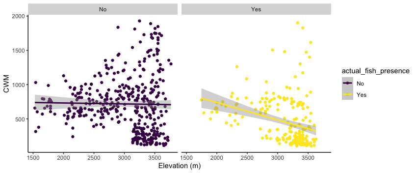

# (SNARC) Sierra Nevada Aquatic Research Consortium
Title: Compositional Turnover in Sierra Nevada Lakes as a Function of Spatial Connectivity and Predation

Author: Matthew D. Green

Status: In Prep.

## Spatial Interactive Maps of Fish Presnce and Zooplankton Diveristy in Sierra Nevada, CA Lakes

Map of Zooplankton Species Diversity: http://rpubs.com/mgree013/836800

Map of Fish Presence: https://rpubs.com/mgree013/836802

## Zooplankton Diversity Patterns as a function of Elevation

## Zooplankton Diversity Patterns as a function of Fish Presence

## Zooplankton Species Specific Desnity Repsonse to Fish Presence

## Zooplankton CWM (Community Weighted Mean) of Body Size as a function of Fish Presence

## Zooplankton CWM (Community Weighted Mean) along Elevational Gradient

